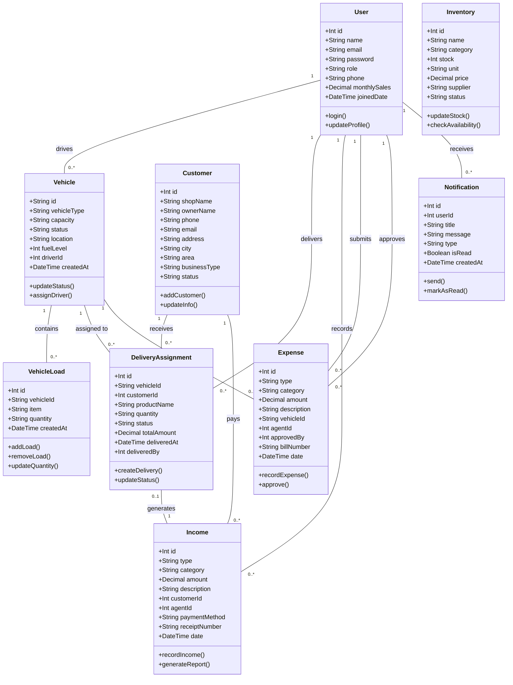

# Inventory Management System - UML Class Diagram

## System Overview
This document presents the UML Class Diagram for the Inventory Management System, designed for water distribution and delivery operations.

---

## UML Class Diagram

---

## Class Descriptions

### 1. User
**Purpose:** Manages system users including administrators and delivery agents.

**Key Attributes:**
- `id`: Unique identifier for each user
- `name`: Full name of the user
- `email`: User's email address (used for login)
- `role`: User role (admin/agent)
- `phone`: Contact phone number
- `monthlySales`: Track agent's monthly sales performance

**Key Methods:**
- `login()`: Authenticate user credentials
- `updateProfile()`: Modify user information

---

### 2. Vehicle
**Purpose:** Tracks delivery vehicles in the fleet.

**Key Attributes:**
- `id`: Vehicle registration number (primary key)
- `vehicleType`: Type of vehicle (e.g., Tata Ace)
- `capacity`: Load capacity
- `status`: Current status (Active/Loading/Maintenance)
- `location`: Current location
- `fuelLevel`: Percentage of fuel remaining
- `driverId`: Assigned driver (references User)

**Key Methods:**
- `updateStatus()`: Change vehicle status
- `assignDriver()`: Assign agent to vehicle

---

### 3. VehicleLoad
**Purpose:** Manages inventory items loaded onto vehicles for distribution.

**Key Attributes:**
- `id`: Unique load identifier
- `vehicleId`: Vehicle containing the load
- `item`: Product name
- `quantity`: Amount loaded (with unit)
- `createdAt`: When the item was loaded

**Key Methods:**
- `addLoad()`: Add new items to vehicle
- `removeLoad()`: Remove items from vehicle
- `updateQuantity()`: Update quantity after distribution

---

### 4. Inventory
**Purpose:** Manages main warehouse inventory.

**Key Attributes:**
- `id`: Unique inventory item identifier
- `name`: Product name
- `category`: Product category
- `stock`: Available quantity
- `unit`: Unit of measurement (bottles, cases, etc.)
- `price`: Unit price
- `supplier`: Supplier name
- `status`: Stock status (In Stock/Low Stock/Out of Stock)

**Key Methods:**
- `updateStock()`: Add or subtract stock
- `checkAvailability()`: Verify stock availability

---

### 5. Customer
**Purpose:** Stores customer/shop information.

**Key Attributes:**
- `id`: Unique customer identifier
- `shopName`: Business name
- `ownerName`: Owner's name
- `phone`: Contact number
- `address`: Physical address
- `city`: City location
- `area`: Area/region
- `businessType`: Type of business (Retail/Wholesale)
- `status`: Account status (Active/Inactive)

**Key Methods:**
- `addCustomer()`: Register new customer
- `updateInfo()`: Modify customer details

---

### 6. DeliveryAssignment
**Purpose:** Manages delivery orders and assignments.

**Key Attributes:**
- `id`: Unique delivery identifier
- `vehicleId`: Assigned vehicle
- `customerId`: Target customer
- `productName`: Product to deliver
- `quantity`: Amount to deliver
- `status`: Delivery status (Pending/In Transit/Delivered/Failed)
- `totalAmount`: Total order value
- `deliveredAt`: Delivery completion time
- `deliveredBy`: Agent who completed delivery

**Key Methods:**
- `createDelivery()`: Create new delivery order
- `updateStatus()`: Update delivery progress

---

### 7. Income
**Purpose:** Tracks all revenue and sales transactions.

**Key Attributes:**
- `id`: Unique income record identifier
- `type`: Income type (Sales/Payment)
- `category`: Income category (Product Sales)
- `amount`: Transaction amount
- `description`: Transaction details
- `customerId`: Customer who paid
- `agentId`: Agent who recorded the sale
- `paymentMethod`: Payment type (Cash/Bank Transfer/Credit)
- `receiptNumber`: Receipt reference
- `date`: Transaction date

**Key Methods:**
- `recordIncome()`: Record new income transaction
- `generateReport()`: Create income reports

---

### 8. Expense
**Purpose:** Manages operational expenses and costs.

**Key Attributes:**
- `id`: Unique expense identifier
- `type`: Expense type (Operational/Maintenance)
- `category`: Expense category
- `amount`: Expense amount
- `description`: Expense details
- `vehicleId`: Related vehicle (if applicable)
- `agentId`: Agent who submitted the expense
- `approvedBy`: Admin who approved the expense
- `billNumber`: Bill reference number
- `date`: Expense date

**Key Methods:**
- `recordExpense()`: Record new expense
- `approve()`: Approve expense claim

---

### 9. Notification
**Purpose:** Manages system notifications to users.

**Key Attributes:**
- `id`: Unique notification identifier
- `userId`: Recipient user
- `title`: Notification title
- `message`: Notification content
- `type`: Notification type (info/success/warning/danger)
- `isRead`: Read status
- `createdAt`: Creation timestamp

**Key Methods:**
- `send()`: Send notification to user
- `markAsRead()`: Mark notification as read

---

## Relationships

### User Relationships
- **User → Vehicle (1:N)**: One agent can be assigned to one vehicle at a time
- **User → DeliveryAssignment (1:N)**: Agents can deliver multiple orders
- **User → Income (1:N)**: Agents record multiple sales transactions
- **User → Expense (1:N)**: Agents submit and approve expenses
- **User → Notification (1:N)**: Users receive multiple notifications

### Vehicle Relationships
- **Vehicle → VehicleLoad (1:N)**: One vehicle contains multiple inventory items
- **Vehicle → DeliveryAssignment (1:N)**: Vehicles are assigned to multiple deliveries
- **Vehicle → Expense (1:N)**: Vehicles incur multiple expenses

### Customer Relationships
- **Customer → DeliveryAssignment (1:N)**: Customers receive multiple deliveries
- **Customer → Income (1:N)**: Customers make multiple payments

### DeliveryAssignment Relationships
- **DeliveryAssignment → Income (1:1)**: Each completed delivery can generate an income record

---

## System Features

### Admin Features
1. User Management (Create/Read/Update/Delete agents)
2. Vehicle Management (Add, assign, track vehicles)
3. Inventory Management (Stock control, reordering)
4. Vehicle Loading (Load products onto vehicles)
5. Customer Management
6. Delivery Assignment
7. Financial Reports (Income/Expense tracking)
8. Dashboard (Real-time statistics)

### Agent Features
1. View Assigned Vehicle
2. View Vehicle Inventory
3. Update Inventory (After distribution to customers)
4. Record Sales Transactions
5. View Assigned Deliveries
6. Update Delivery Status
7. Submit Expenses

---

## Technology Stack
- **Backend:** Node.js with Express
- **Database:** PostgreSQL with Prisma ORM
- **Frontend:** React with Vite
- **Authentication:** JWT-based authentication
- **Styling:** Tailwind CSS

---

## Database Schema
The system uses PostgreSQL database with the following key tables:
- Users
- Vehicles
- VehicleLoads
- Inventory
- Customers
- DeliveryAssignments
- Income
- Expenses
- Notifications

---

## Security Features
- JWT-based authentication
- Role-based access control (Admin/Agent)
- Password encryption
- Protected API routes
- Input validation

---

**Document Generated:** February 26, 2026  
**Project:** Inventory Management System  
**Version:** 1.0
